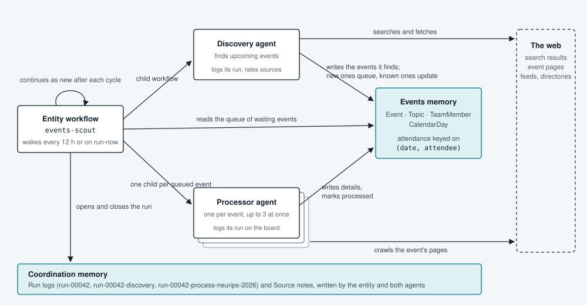

# temporal-xmemory-events-agent

[](https://github.com/xmemory-ai/temporal-xmemory-events-agent/actions/workflows/ci.yml)

Two AI agents that research AI conferences, meetups, hackathons and summits on the internet, month after month, and keep what they learn in a shared memory that people and other agents can query in plain language. They run on [Temporal](https://temporal.io), so a crashed or redeployed worker resumes in the middle of a cycle instead of starting over, and on [xmemory](https://xmemory.ai), so the knowledge outlives any single run.

## What it does

- The **Discovery** agent searches the web and directories for upcoming AI events and writes each one to the events memory with its canonical name, website and a one-line discovery note. It never looks an event up first and never states a status: xmemory resolves records by name, so a known event is updated rather than duplicated, and a new one has no status yet, which is what queues it for processing.
- The **Processor** agent takes one queued event, crawls its pages, writes the details (dates, venue, call for papers, registration, prices, topics) and marks the event `processed`, or `failed` with a note.

Both agents are built on the OpenAI Agents SDK. Inside a stage the model decides what to search, fetch and write; the only fixed structure is the cycle around them. Two xmemory instances hold the state, both written as plain prose that xmemory's extraction engine turns into records:

- `events`: `Event` (with its processing status: empty or `unprocessed` while waiting, then `processed` or `failed`), `Topic`, `TeamMember`, `CalendarDay`, and the `attendance` relation, which links a team member to an event on a day and is keyed on `(date, attendee)` so a person can attend only one event per day.
- `coordination`: `Source` notes (which sources are good or poor) and `Run` logs for every cycle and stage.

Once it has run for a while you can ask things like "Which AI conferences in Europe have a CFP deadline in the next 90 days?" or "Who from the team attends what in December?" and get an answer from the records, not from a transcript.

## Why Temporal and xmemory

- **The work never finishes.** Discovery and processing repeat on a cadence for as long as the worker is up. Temporal keeps that loop alive as a single long-lived workflow and, when a worker crashes or is redeployed mid-cycle, continues from the last completed step: no model call is repeated, no page is fetched twice, no memory write is issued twice.
- **Two agents, one memory.** The agents never call each other; the memory is the hand-off. xmemory turns each agent's prose into structured records keyed by the event's name, so a second mention updates a record instead of duplicating it, and a mention that says nothing about an event's status leaves that status alone. The next cycle, the next agent, or a person starts from what earlier runs learned.
- **Steerable while it runs.** Signals tell the running entity to run a cycle now, pause, resume, stop, or take an operator instruction for the next discovery; a query reports where it stands. The Temporal UI shows every cycle, child workflow and activity.
- **State where it belongs.** Temporal holds the cursor of the work in progress (cycle counter, pending instructions, next due time). xmemory holds what is known. The agents hold nothing.



## How it uses Temporal

- **Entity workflow.** `EventScoutWorkflow` in `src/temporal_xmemory_events_agent/workflows/scout.py` is one always-alive workflow per agent. Its state is initialised in `@workflow.init`, because signals delivered with the first workflow task run before `run` starts. After every cycle it calls `continue_as_new`, carrying the cycle counter, pending instructions and the next due time, so history never grows beyond one cycle.
- **Cadence without polling.** The wait loop is `workflow.wait_condition(..., timeout=...)`: the timeout is the cadence timer, and the condition wakes on any signal. While paused only `run_now` or `stop` wake it.
- **Signals and a query that the logic consumes.** `run_now`, `pause`, `resume`, `stop` and `instruct` only mutate workflow state; the wait loop and the next brief read that state. `status` is a query over the same state. The CLI's `run-now`, `instruct`, `pause`, `resume`, `stop` and `status` commands map to them one to one.
- **Child workflows with deterministic ids.** Discovery (`workflows/discovery.py`) and each processing run (`workflows/processing.py`) are child workflows with ids `{workflow_id}-{run_id}-{stage}`, where `run_id` derives from the carried cycle counter. A retried workflow task or a replay therefore cannot start a duplicate child; the id is the idempotency key. Each child has its own `run_timeout`, processing children fan out under an `asyncio.Semaphore` (deterministic inside workflow code), and a failed child is recorded by the entity, never fatal to it.
- **Model calls are activities.** Both agents run through Temporal's OpenAI Agents SDK integration (`OpenAIAgentsPlugin`, see `worker.py` and `workflows/stage_runner.py`): every model turn is an activity with a 5-minute timeout and a bounded retry policy, and on replay the stored response is returned rather than the model invoked again. The agents' tools run in workflow code and do their I/O only through activities.
- **Memory operations are activities.** Events reads and writes go through the `xmemory-temporal` plugin: a durable write is one `write_start` activity, the only non-idempotent step, followed by idempotent status polls with `workflow.sleep` between them (`agents/tools.py`). The coordination board uses two small activities of its own (`memory/board_activities.py`, handle in `memory/board.py`). `tests/test_discovery_workflow.py` runs a stage with `max_cached_workflows=0`, forcing a replay after every task, and asserts that `write_start` is scheduled exactly once per remember.
- **Timeouts and retries are explicit and asymmetric.** Content writes carry keys extracted from the text, so they retry only when nothing was enqueued (rate limit, quota) and never after a lost response (`workflows/stage_runner.py`); board writes carry literal keys and retry freely (`memory/board.py`); a page fetch gets one attempt and the model decides what to do with a failure (`agents/tools.py`, `activities/fetch.py`).
- **Tests at three levels.** Unit tests need no credentials. Memory-backed tests run the real activities and workflows on a local Temporal dev server against real xmemory instances created and deleted per session, with a scripted model. A live test runs a real model against the real web. See Tests below.

## Requirements and costs

- Python 3.12+, [uv](https://docs.astral.sh/uv/), and the Temporal CLI for a local dev server (free; `temporal server start-dev`).
- An **OpenAI API key**. Each cycle spends model turns (up to 40 per stage by default) and hosted web search calls; the default model in the template is `gpt-5.4-mini`. Budgets live in `config.yml`: cycle interval 12 hours, at most 10 events processed per cycle, 3 in parallel, 25 fetches per stage.
- An **xmemory account and API key**, for two instances created from `schema/`. Each memory write is an extraction on your xmemory plan; deep writes take tens of seconds, so a cycle with several events takes minutes.
- **There is no keyless demo.** Every run and the memory-backed tests need a real xmemory key; the model is real too, except in tests, where it is scripted. Only the unit tests (page cleaner, fetch activity, parsing, config, schema structure) run without any credentials.

## Step-by-step guide

All commands run from the repository root. Steps marked *once* are setup and need not be repeated.

### 1. Install (once)

You need Python 3.12+, [uv](https://docs.astral.sh/uv/), the [Temporal CLI](https://docs.temporal.io/cli), an OpenAI API key and an xmemory API key.

```bash
uv sync --dev
uv tool install xmemcli        # the xmemory CLI, used to create the instances in step 4
```

### 2. Credentials in `.env` (once)

Create a gitignored `.env` in the repository root. Every command loads it before anything else and never overrides a variable that is already exported. Each memory can name its own key variable in `config.yml`; `XMEM_API_KEY` is the shared fallback. Nothing secret goes into `config.yml`.

```bash
# .env
export XMEM_API_KEY=xmem_...
export OPENAI_API_KEY=sk-...
```

The tests do not read `.env`; export the variables in the terminal that runs them (see Tests below).

### 3. Configure (once)

Copy the template and set the model. Every value resolves in this order: a CLI flag (`--events-url`, `--events-api-key-env`, `--events-instance-id`, and the same for `--coordination-*`), then `config.yml`, then the environment, then the library default. The two instances may live on different servers or accounts.

```bash
cp config.yml.template config.yml
```

```yaml
xmemory:
  events:
    url: https://api.xmemory.ai          # unset -> XMEM_API_URL -> https://api.xmemory.ai
    api_key_env: XMEM_EVENTS_API_KEY     # unset or empty -> XMEM_API_KEY
    instance_id: ""                       # filled in step 4
  coordination:
    url: https://api.xmemory.ai
    api_key_env: XMEM_COORD_API_KEY
    instance_id: ""
openai:
  model: gpt-5.4-mini                       # verified against the OpenAI models list by `create-instances`
```

The `scout` section sets the cadence and the budgets: cycle interval, events processed per cycle, parallel processing, turns and fetches per stage, fetch window size, politeness delay between requests to one host.

### 4. Create the instances and seed the board (once)

With the xmemory CLI, as the [agent onboarding prompt](https://xmemory.ai/agent-onboarding-prompt.txt) prescribes: it authenticates with the same `XMEM_API_KEY`, validates the XMD, creates each instance with the schema's conventions as its description, and prints connect instructions for agent surfaces. Paste the two ids into `config.yml`.

```bash
xmemcli xmd validate schema/events.yml
xmemcli xmd validate schema/coordination.yml
xmemcli instance create --name "AI Events" --schema-file schema/events.yml
xmemcli instance create --name "Events Agent Coordination" --schema-file schema/coordination.yml
```

The project's own command does the same through the client library and records the ids in `config.yml` for you (it refuses to overwrite an id already there unless `--force`):

```bash
uv run temporal-xmemory-events-agent create-instances --write-config
```

Then seed the board, a starting list of sources for the Discovery agent (re-runnable):

```bash
uv run temporal-xmemory-events-agent seed-board
```

### 5. Team members and attendance (optional)

People enter these, one sentence per fact, with the event in its canonical name and the day as an ISO date; the agents never write them. `seeds/team.md` shows the sentences to use.

```bash
uv run temporal-xmemory-events-agent remember --target events "Alexander Gusak is a member of the xmemory team, role engineer."
uv run temporal-xmemory-events-agent remember --target events "Alexander Gusak attends NeurIPS 2026 on 2026-12-07."
```

### 6. Temporal dev server (terminal 1)

The UI is at http://localhost:8233. By default the dev server keeps its state in memory, so a restart forgets the entity workflow and you run `start` again afterwards. For durable runs give it a database file: workflow histories then survive server restarts, the entity keeps its cadence, cycle counter and pending instructions, and a worker that comes back simply continues the in-flight cycle.

```bash
temporal server start-dev --db-filename temporal.db
```

`temporal.db` and its sidecar files are gitignored. Delete the file to start from a clean slate.

### 7. Worker (terminal 2)

Runs the workflows, the fetch and board activities, and both memory plugins. Ctrl-C drains it and stops.

```bash
uv run temporal-xmemory-events-agent worker
```

### 8. Start the entity (terminal 3)

`start` runs a first cycle at once and then one every `cycle_interval_hours`. `start --paused` waits for `run-now` instead. A cycle spends OpenAI tokens: a few Discovery turns plus one Processor run per queued event, capped by `max_events_processed_per_cycle`.

```bash
uv run temporal-xmemory-events-agent start
```

### 9. Steer and watch

| Command | What it does |
| --- | --- |
| `instruct "…"` | Queues an operator instruction for the next cycle's Discovery brief. One containing `process only` skips discovery that cycle. |
| `run-now` | Runs a cycle immediately, also while paused. |
| `status` | State, cycle number, last run id and summary, next due time, pending instructions. |
| `queue` | The unprocessed events, read exactly the way the workflow reads them. |
| `ask "…"` | A plain-language question to the events memory. |
| `board "…"` | A plain-language question to the coordination memory. |
| `pause` / `resume` | Suspends or restores the cadence after the current cycle. |
| `stop` | Ends the entity after the current cycle; `start` brings it back. |

```bash
uv run temporal-xmemory-events-agent instruct "Focus on AI meetups in Berlin and London this month"
uv run temporal-xmemory-events-agent run-now
uv run temporal-xmemory-events-agent status
uv run temporal-xmemory-events-agent queue
uv run temporal-xmemory-events-agent ask "Which AI conferences in Europe have a CFP deadline in the next 90 days?"
uv run temporal-xmemory-events-agent board "What did the latest runs do, and which sources are good?"
```

In the Temporal UI each cycle shows the `events-scout` run, one Discovery child, one processing child per event, and inside them the model, fetch, board and xmemory activities. Deep memory writes take tens of seconds each, so a cycle with several events takes a few minutes. The xmemory console shows Event and Run rows as they land.

## How memory is written

The agents never emit schema JSON. They write prose and xmemory extracts the records, so the conventions in `src/temporal_xmemory_events_agent/agents/common.py` matter: the canonical event name (short name plus year) in every sentence, ISO dates, one write per event or small group, additive wording. The instance descriptions in the schema files repeat these conventions for any other agent connected to the same instances.

## Tests

```bash
uv run ruff check src tests
uv run ruff format --check src tests
uv run pyright src tests
uv run pytest -m "not live"
```

There is no fake xmemory. Unit tests (cleaner, robots, fetch activity, parsing, briefs, config, schema structure) need no backend. Memory-backed tests need `XMEM_API_KEY` exported (pytest does not read `.env`) and `XMEM_API_URL` unless the default server is meant: a session fixture creates throwaway instances from the two schemas, the tests run the real activities and workflows against them with a scripted model and fixture-backed web pages, and the instances are deleted afterwards (`--keep-instances` keeps them). Deep writes take tens of seconds, so that tier runs in minutes.

The `live` test additionally needs `OPENAI_API_KEY` and `OPENAI_MODEL`, runs a real model against the real web on throwaway instances, and costs money:

```bash
OPENAI_MODEL=gpt-5.4-mini uv run pytest -m live
```

## Sharp edges

- Do not run the worker with `async with Worker(...)`. With a plugin that closes an HTTP client in its run context, the SDK cancels the worker's run task while that close is still in flight and then cancels the caller. `worker.py` and the test harness start `worker.run()` in a task, await `worker.shutdown()`, then await the run task.
- The entity initialises its state in an `@workflow.init` constructor, because Temporal runs signal handlers that arrive with the first workflow task before `run` starts.
- The `xmemory-temporal` plugin registers fixed activity names, so one worker can bind it to one instance. The coordination instance uses the small `board_read` / `board_write` activities in `memory/board_activities.py` instead.
- The processing status has no schema default on purpose. In xmemory a field default is filled by the extractor on every write, so a default of `unprocessed` was re-applied whenever a processed event was mentioned again (a re-discovery, an attendance note) and reset it. With no default, a mention that does not state a status leaves the stored value alone, and the queue read treats an empty status as "waiting".

## Layout

```
schema/            XMD schemas of the two instances
seeds/             seed knowledge for the board and the team-member template
src/temporal_xmemory_events_agent/
  run.py           CLI entrypoint
  config.py        config.yml + environment + flags -> Settings
  memory/          targets, instance admin, board activities and handle, structured-read parsing, queries
  web/             page cleaning (JSON-LD event data, main text, feeds) and robots.txt
  activities/      the web fetch activity and the activity names
  agents/          instructions, briefs, tools and the two agent definitions
  workflows/       the entity, the Discovery stage and the per-event Processing stage
  worker.py        client with both plugins, worker with all workflows and activities
tests/             unit tests, real-backend tests with throwaway instances, the live test
```

## Legal

- Privacy policy: <https://xmemory.ai/privacy-policy.html>
- Terms: <https://xmemory.ai/terms-and-conditions.html>

**MIT licensed**, see [`LICENSE`](./LICENSE). The MIT grant covers only this example agent's own code. The xmemory service and its underlying technology, the backend, memory engine, schemas, extraction and reader models, and hosted infrastructure, remain **proprietary to xmemory Inc.** and are not licensed here; use of the service requires valid credentials and is governed by the Terms above. The supplemental scope, proprietary-service and trademark notices live in [`NOTICE`](./NOTICE), kept separate from `LICENSE` so the package classifies cleanly as MIT.
